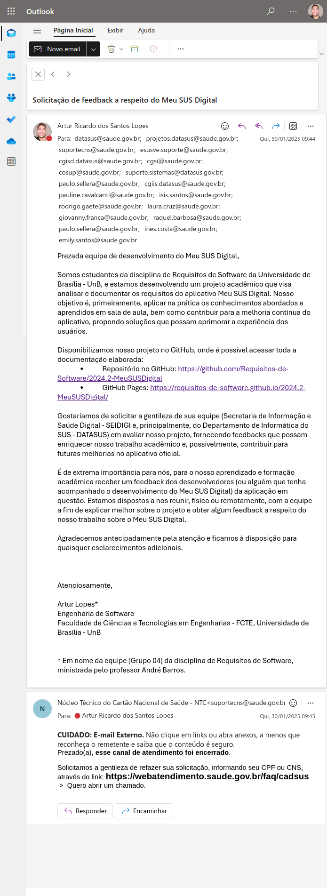

# Resultados Alcançados

## Introdução

Ao chegar à última etapa do projeto, o Grupo 4 adquiriu conhecimentos de diversas atividades da disciplina de Requisitos de Software, que foram exercitadas sobre o aplicativo Meu SUS Digital. Este documento busca relatar os resultados alcançados pelo grupo, com base nos objetivos do projeto.

## Objetivos do Projeto

Os objetivos gerais identificados pelo grupo, e seus respectivos resultados são:

- **Planejar e trabalhar em equipe**: durante todo o projeto, o grupo vem exercitando a comunicação, o planejamento e o trabalho em conjunto.
- **Entender o Domínio do Problema e Identificar as Necessidades do Usuário**: buscamos compreender como o Meu SUS Digital impacta seus usuários, quem são esses usuários e qual a visão que eles têm sobre o aplicativo. O propósito de tudo isso é entender o papel e os impactos (positivos e negativos) desse aplicativo sobre aqueles que o utilizam.
- **Elicitar e Priorizar Requisitos**: a partir da colaboração com usuários do aplicativo, fomos capazes de identificar e declarar necessidades e restrições que o Meu SUS Digital deve atender, muitas das quais não são atendidas atualmente. Esses requisitos não atendidos foram priorizados pela equipe, com a colaboração de usuários.
- **Modelar Requisitos**: o grupo adquiriu conhecimentos sobre diversas formas de modelar requisitos, com o fim de melhorar a comunicação dos requisitos e a visualização da solução.
- **Verificar e Validar**: compreendemos que manter a qualidade e corretude a cada fase da Engenharia de Requisitos é chave para um projeto e produto de sucesso. Isso requer a aplicação de técnicas que envolvem não só o engenheiro e o desenvolvedor (como na verificação), mas também o usuário (como na validação).
- **Documentar**: aprendemos que existem aspectos de qualidade no projeto, como a rastreabilidade e padronização, que ajudam a manter a clareza e objetividade da documentação e facilitam o processo de desenvolvimento de um software.

## Tentativa de Contato com a Equipe de Desenvolvimento

### Contexto

Com o objetivo de obter feedback e colaboração da equipe responsável pelo desenvolvimento do **Meu SUS Digital**, o Grupo 4 entrou em contato com diferentes canais do Ministério da Saúde e do DATASUS para apresentar o projeto e solicitar um retorno.

### Contato Realizado

O contato foi feito por e-mail para múltiplos endereços da equipe de suporte e desenvolvimento do DATASUS, descrevendo os objetivos do projeto acadêmico e solicitando uma possível colaboração para avaliação dos requisitos identificados. O e-mail incluía links para a documentação no **GitHub** e **GitHub Pages**.

### Respostas Obtidas

1. **Primeira Resposta**: Recebemos um e-mail automático informando que o atendimento foi finalizado sem um retorno específico sobre o nosso pedido.
2. **Segunda Resposta**: O Núcleo Técnico do Cartão Nacional de Saúde respondeu que o canal de atendimento utilizado foi encerrado e indicou outro portal para abrir um chamado, exigindo informações como CPF ou CNS.

Diante dessas respostas, não conseguimos estabelecer uma comunicação direta com os desenvolvedores responsáveis pelo **Meu SUS Digital**, o que limitou nossa capacidade de validar e discutir os requisitos levantados diretamente com a equipe oficial do projeto.

### Evidências do Contato

A seguir, apresentamos capturas de tela das tentativas de contato com a equipe responsável pelo desenvolvimento do **Meu SUS Digital**:

Na **Figura 1** podemos identificar o e-mail enviado à equipe do DATASUS solicitando feedback sobre o projeto.

    
<strong>Figura 1 – Primeira Evidência de Contato</strong>

    
Autor: <a href="https://github.com/algorithmorphic">Artur Ricardo</a>.

Na **Figura 2** podemos identificar a resposta automática indicando o encerramento do canal de atendimento.

    
<strong>Figura 2 – Segunda Evidência de Contato</strong>

    
Autor: <a href="https://github.com/algorithmorphic">Artur Ricardo</a>.

### Conclusão

Apesar da tentativa de contato, a ausência de um retorno direto da equipe do Ministério da Saúde impediu que tivéssemos uma colaboração efetiva. Esse fator reforça a importância de canais de comunicação acessíveis para projetos acadêmicos e contribuições externas que possam aprimorar sistemas governamentais.

## 📑 Histórico de versão
| Versão | Descrição | Autor(es) | Data de Produção | Revisor(es) | Data de Revisão |   
|:------:|:-------------------------------:|:--------------:|:--------------:|:-------------:|:---------------------:|
|  `1.0`  | Criação do documento. |[João Pedro](https://github.com/JoosPerro)| 10/02/2025  | [Artur Lopes](https://github.com/) | 10/02/2025 |
|  `1.1`  | Adição da seção de tentativa de contato com a equipe de desenvolvimento e inclusão das evidências do contato com imagens. |[Artur Lopes](https://github.com/) | 10/02/2025 |  |  |