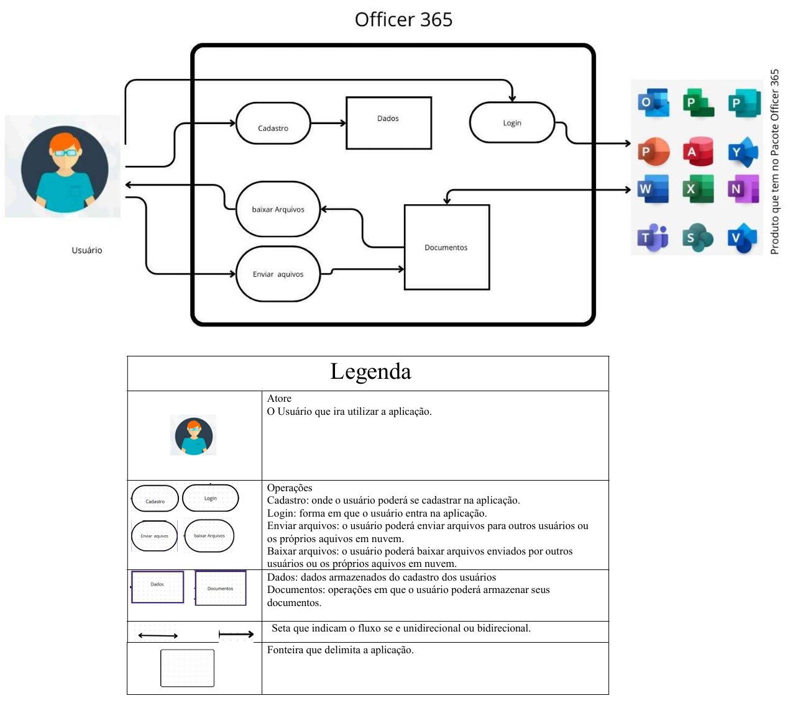

# Aplicativos Avaliados

## Introdução

Para iniciar o projeto, cada membro do grupo escolheu individualmente um aplicativo que tivesse potencial para ser analisado. O propósito dessa etapa foi selecionar um aplicativo que serviria como o foco principal de estudo para a disciplina de Requisitos de Software. A **Tabela 1** a seguir mostra os aplicativos considerados, acompanhados do nome do integrante/avaliador responsável por cada análise/avaliação.

    
<strong>Tabela 1 – Aplicativos Avaliados</strong>

  <table>
    <thead>
      <tr>
        <th style="text-align: center;">Aplicativo Avaliado</th>
        <th style="text-align: center;">Avaliador(a)</th>
      </tr>
    </thead>
    <tbody>
      <tr>
        <td style="text-align: center;">Meu SUS Digital</td>
        <td style="text-align: center;"><a href="https://github.com/algorithmorphic">Artur Ricardo</a></td>
      </tr>
      <tr>
        <td style="text-align: center;">Office 365</td>
        <td style="text-align: center;"><a href="https://github.com/EmivaltoJrr">Emivalto junior</a></td>
      </tr>
      <tr>
        <td style="text-align: center;">Correios</td>
        <td style="text-align: center;"><a href="https://github.com/JoosPerro">João Pedro</a></td>
      </tr>
      <tr>
        <td style="text-align: center;">Baratão Combustíveis</td>
        <td style="text-align: center;"><a href="https://github.com/MatheusHenrickSantos">Matheus Henrick</a></td>
      </tr>
      <tr>
        <td style="text-align: center;">Steam</td>
        <td style="text-align: center;"><a href="https://github.com/pLopess">Pedro Lopes</a></td>
      </tr>
    </tbody>
  </table>

    
Autores: <a href="https://github.com/algorithmorphic">Artur Ricardo</a> e <a href="https://github.com/pLopess">Pedro Lopes</a>.

---

### Meu SUS Digital

O [Meu SUS Digital](https://meususdigital.saude.gov.br/) é um aplicativo governamental desenvolvido com o objetivo de facilitar o acesso dos cidadãos aos serviços de saúde pública oferecidos pelo Sistema Único de Saúde (SUS) no Brasil. Através do aplicativo, os usuários podem acessar informações importantes sobre seu histórico de atendimentos, vacinas, exames e outros serviços relacionados à saúde. Disponível para dispositivos móveis, o Meu SUS Digital visa aproximar os serviços de saúde pública dos cidadãos e promover uma gestão mais eficiente dos dados de saúde. A escolha desse aplicativo para avaliação foi baseada nos seguintes critérios:

- **Requisito**: O aplicativo se encaixa no escopo da disciplina de Requisitos de Software, atendendo à proposta de análise de aplicativos governamentais e de código aberto.
- **Novidade**: Este aplicativo ainda não foi amplamente analisado em semestres anteriores, proporcionando uma nova oportunidade de estudo.
- **Complexidade**: O aplicativo possui uma estrutura que, embora não seja tão complexa quanto a de alguns dos apps avaliados por outros membros da equipe, envolve uma série de funcionalidades críticas e integrações com bancos de dados governamentais, o que torna a análise desafiadora.
- **Público-alvo amplo**: Por ser um aplicativo de acesso público, destinado a toda a população brasileira que utiliza o SUS, o Meu SUS Digital atende a um público-alvo diversificado em termos de idade, escolaridade e familiaridade com tecnologia. Essa diversidade proporciona uma rica base para coleta de feedback e análise de usabilidade.

## *Rich Picture* do aplicativo Meu SUS Digital

Abaixo, podemos identificar a **Figura 1** contendo tanto o *Rich Picture* do aplicativo Meu SUS Digital quanto sua legenda.

    
<strong>Figura 1 – <em>Rich Picture</em> do aplicativo Meu SUS Digital</strong>

    
    
Autor: <a href="https://github.com/algorithmorphic">Artur Ricardo</a>.

---

### Steam

A [Steam](https://store.steampowered.com/) é uma plataforma de distribuição digital desenvolvida pela [Valve Corporation](https://www.valvesoftware.com/), amplamente utilizada para a compra, gerenciamento e jogabilidade de jogos eletrônicos no mundo inteiro. Disponível para desktops e dispositivos móveis, o Steam oferece uma ampla biblioteca de jogos e funcionalidades como comunidades de jogadores, suporte para mods, e recursos avançados de segurança e privacidade. A escolha dessa plataforma foi feita com base nos seguintes critérios:

- **Requisito**: se encaixa no escopo de análise de software proposto pela disciplina.

- **Novidade**: O App não foi analisado em semestres anteriores.

- **Complexidade**: A plataforma apresenta uma estrutura complexa, com diversas funcionalidades.

- **Público-alvo amplo**: É utilizado por muitos usuários, de diferentes faixas etárias e perfis, tornando-se uma escolha acessível para a coleta de feedback e análise de usabilidade.

### *Rich Picture* da Steam
Abaixo, podemos identificar a **Figura 2** contendo tanto o *Rich Picture* da Steam quanto sua legenda.

    
<strong>Figura 2 – <em>Rich Picture</em> da Steam</strong>

    
    
Autor: <a href="https://github.com/pLopess">Pedro Lopes</a>.

---

### Baratão Combustíveis

O [Baratão Combustíveis](https://barataocombustiveis.com.br/) é um aplicativo desenvolvido pela Baratão Tecnologia LTDA, sendo a primeira plataforma para venda de combustíveis do mercado. Ele oferece desconto no preço de combustíveis em postos credenciados, além de parcelamento em débitos veiculares. Está disponível para dispositivos móveis. A escolha deste aplicativo para avaliação foi baseada nos seguintes critérios:

- **Requisito**: O aplicativo se encaixa no escopo da disciplina de Requisitos de Software, pois trata-se de um software com público-alvo específico e funcionalidades relevantes para análise de usabilidade.
- **Novidade**: Este aplicativo ainda não foi trabalhado em semestres anteriores.
- **Complexidade**: A plataforma possui complexidade adequada, com funcionalidades específicas voltadas para o público-alvo.
- **Público-alvo relevante**: O aplicativo é voltado para indivíduos habilitados para conduzir veículos, representando uma alternativa atrativa para condutores de serviços de transporte por aplicativo e para aqueles que realizam frequentes deslocamentos.

### *Rich Picture* do Baratão Combustíveis
Abaixo, podemos identificar a **Figura 3** contendo tanto o *Rich Picture* do Baratão Combustíveis quanto sua legenda.

    
<strong>Figura 3 – <em>Rich Picture</em> do Baratão Combustíveis</strong>

    
    
Autor: <a href="https://github.com/MatheusHenrickSantos">Matheus Henrick</a>.

---

### Office 365

O [Office 365](https://www.office.com/) é uma plataforma da [Microsoft](https://www.microsoft.com/pt-br/) distribuição digital dos servisos que ela oferece, amplamente utilizada por muitas empressas cooporativas e tambem com usuarios comuns, onde se pode ter acessos aos programas mais comuns de quase todos os escritorios, como por exemplo o Word, Excel e PowerPoint os mais comuns, e possivel tambem dazer um gerenciamento dos seus arquivos em nuvem pelo OneDrive que tambem e oferecido junto ao Officer 365 no mundo inteiro. Disponível para desktops e dispositivos móveis, o Officer 365 oferece uma ampla variedade de funcionalidades com todos os seus produtos oferecidos, com recursos de segurança e privacidade. A escolha dessa plataforma foi feita com base nos seguintes critérios:

- **Requisito**: se encaixa no escopo de análise de software proposto pela disciplina.

- **Novidade**: O App não foi analisado em semestres anteriores.

- **Complexidade**: A plataforma apresenta uma estrutura complexa, com diversas funcionalidades.

- **Público-alvo amplo**: É utilizado por muitos usuários, de diferentes faixas etárias e perfis, tornando-se uma escolha acessível para a coleta de feedback e análise de usabilidade.

### *Rich Picture* do Officer 365

Abaixo, podemos identificar a **Figura 4** contendo tanto o *Rich Picture* do Officer 365 quanto sua legenda.

    
<strong>Figura 4 – <em>Rich Picture</em> do Oficer 365</strong>

    
    
Autor: <a href="https://github.com/EmivaltoJrr">Emivalto Junio</a>.

---

### Correios

O [Correios](https://www.correios.com.br/app-dos-correios) é um aplicativo oficial da [Empresa Brasileira de Correios e Telégrafos](https://www.correios.com.br/), responsável pelo serviço postal no Brasil. Este aplicativo permite aos usuários acompanhar o status de suas encomendas, calcular prazos e preços de envio, localizar agências e acessar serviços relacionados a correspondências e encomendas. Disponível para dispositivos móveis, o app dos Correios facilita a interação entre os cidadãos e os serviços postais, promovendo maior transparência e acessibilidade. A escolha deste aplicativo para análise foi baseada nos seguintes critérios:

- **Requisito**: O aplicativo se encaixa no escopo de análise da disciplina de Requisitos de Software, atendendo à proposta de avaliação de aplicativos governamentais.
- **Novidade**: Este aplicativo ainda não foi analisado em semestres anteriores, oferecendo uma nova oportunidade de estudo.
- **Complexidade**: Embora não seja extremamente complexo, o aplicativo oferece funcionalidades importantes e críticas, como rastreamento em tempo real e cálculo de prazos, tornando a análise relevante para um estudo de requisitos.
- **Público-alvo amplo**: Destinado a uma ampla faixa da população brasileira, o aplicativo atende a diversos perfis de usuários que realizam envios ou recebem encomendas com frequência, sendo útil para análise de usabilidade e feedback de uma base diversificada de usuários.

### *Rich Picture* do Correios

Abaixo, podemos identificar a **Figura 5** contendo tanto o *Rich Picture* do Correios quanto sua legenda.

    
<strong>Figura 5 – <em>Rich Picture</em> do Correios</strong>

    
    
Autor: <a href="https://github.com/JoosPerro">João Pedro</a>.

---

## 📚 Referências Bibliográficas

> - BARATÃO COMBUSTÍVEIS. Baratão Combustíveis. Baratão Combustíveis, 2024. Disponível em: https://barataocombustiveis.com.br. Acesso em: 05 nov. 2024.
>
> - BRASIL. Correios. Empresa Brasileira de Correios e Telégrafos, 2024. Disponível em: https://www.correios.com.br. Acesso em: 05 nov. 2024.
>
> - BRASIL. Meu SUS Digital. Ministério da Saúde, 2024. Disponível em: https://meususdigital.saude.gov.br. Acesso em: 05 nov. 2024.
>
> - MICROSOFT. Office 365. Microsoft, 2024. Disponível em: https://www.office.com/. Acesso em: 05 nov. 2024.
>
> - VALVE CORPORATION. Steam. Valve Corporation, 2024. Disponível em: https://store.steampowered.com/. Acesso em: 05 nov. 2024.

## 📑 Histórico de Versões

| Versão | Descrição | Autor(es) | Data de Produção | Revisor(es) | Data de Revisão | 
| :----: | --------- | --------- | :--------------: | ----------- | :-------------: |
| `1.0`  | Criação do documento. | [Pedro Lopes](https://github.com/pLopess) | 27/10/2024 | [Artur Ricardo](https://github.com/algorithmorphic) | 05/11/2024 |
| `1.1`  | Atualização do documento. | [Pedro Lopes](https://github.com/pLopess) | 27/10/2024 | [Artur Ricardo](https://github.com/algorithmorphic) | 05/11/2024 |
| `1.2`  | Atualização do documento. | [Matheus Henrick](https://github.com/MatheusHenrickSantos) | 05/10/2024 | [Artur Ricardo](https://github.com/algorithmorphic) | 05/11/2024 |
| `1.3`  | Inserção e padronização de avaliações, correção de erros e adição das Referências Bibliográficas. | [Artur Ricardo](https://github.com/algorithmorphic) | 05/11/2024 | [Pedro Lopes](https://github.com/pLopess) | 05/11/2024 |
| `1.3`  | Inserção e padronização dos Rich Picture, correção de erros. | [Emivalto Junio](https://github.com/EmivaltoJrr) | 30/11/2024 |  |  |
| `1.4`  | Padronizaçao e correções | [Emivalto Júnior](https://github.com/EmivaltoJrr) | 06/02/2025 |  |   |

