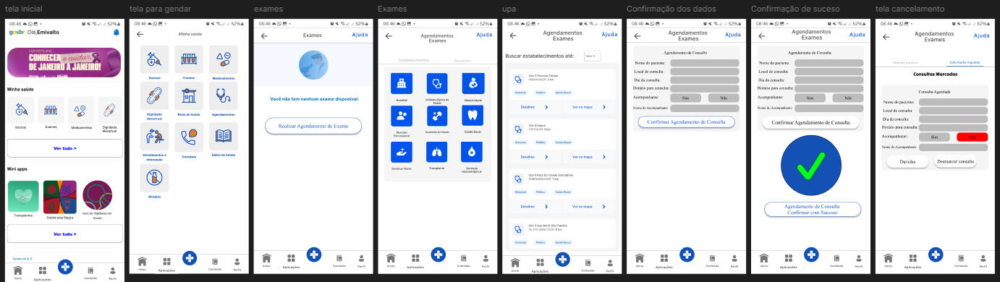

# Protótipo de Alta Fidelidade - Agendamento de Exames

## Introdução

Um protótipo de alta fidelidade é uma representação visual detalhada da interface de um sistema, simulando com precisão a experiência do produto final. Ele integra elementos gráficos refinados e funcionalidades interativas, permitindo uma avaliação completa da usabilidade e a validação dos requisitos. 

Este documento apresenta o protótipo de alta fidelidade desenvolvido para atender ao requisito [**RF58 - A aplicação permite agendar exames**](https://requisitos-de-software.github.io/2024.2-MeuSUSDigital/elicitacao/requisitos-elicitados/#RF58) do aplicativo [Meu SUS Digital](https://meususdigital.saude.gov.br/). O objetivo principal é validar a interface e a experiência do usuário no processo de agendamento de exames, garantindo que a solução proposta atenda às necessidades dos pacientes e profissionais de saúde de forma prática, intuitiva e eficiente.

## Metodologia

O desenvolvimento e validação do protótipo seguiram as diretrizes da Engenharia de Requisitos, com foco em elicitação, modelagem e validação de soluções. A ferramenta [Figma](https://www.figma.com) foi utilizada para a criação do protótipo, que foi submetido à avaliação de uma usuária real por meio de uma entrevista semiestruturada. O cronograma detalhado da validação encontra-se na **Tabela 1**.

    
<strong>Tabela 1 – Cronograma de validação do protótipo</strong>

| Avaliador | Entrevistado | Horário de Início | Horário de Término | Data | Ambiente/Local | 
| --------- | ------------ | :---------------: | :----------------: | :--: | -------------- |
| [Emivalto Júnior](https://github.com/EmivaltoJrr) | Vitoria | 21:24 | 21:30  | 07/02/2025  | Gravado Presenvial  |

    
Autor: <a href="https://github.com/EmivaltoJrr">Emivalto Júnior</a>.

## Protótipo de Alta Fidelidade

A **Figura 1** apresenta a interface desenvolvida para o agendamento de exames. O protótipo permite que os usuários realizem as seguintes ações:

- Selecionar o exame desejado a partir de uma lista de opções;
- Escolher a data e o horário disponíveis para o exame;
- Confirmar o agendamento diretamente pela interface;
- Visualizar informações detalhadas sobre a unidade de saúde onde o exame será realizado.

Além disso, o design prioriza a clareza das informações e a organização visual, facilitando a navegação e garantindo um processo de agendamento eficiente.

    
<strong>Figura 1 – Protótipo de "Agendamento de Exames"</strong>

    
Autor: <a href="https://github.com/EmivaltoJrr">Emivalto Júnior</a>.

Na **Figura 2**, é exibido o protótipo completo/geral desenvolvido no Figma, que abrange não apenas o agendamento de exames, mas também funcionalidades relacionadas, como consulta e cancelamento de exames agendados. Este protótipo atende aos requisitos [**RF58**](https://requisitos-de-software.github.io/2024.2-MeuSUSDigital/elicitacao/requisitos-elicitados/#RF58), [**RF59**](https://requisitos-de-software.github.io/2024.2-MeuSUSDigital/elicitacao/requisitos-elicitados/#RF59) e [**RF60**](https://requisitos-de-software.github.io/2024.2-MeuSUSDigital/elicitacao/requisitos-elicitados/#RF60). O design passou por iterações baseadas em feedbacks coletados durante a validação, garantindo melhorias contínuas e aprimorando a experiência do usuário.

    
<strong>Figura 2 – Protótipo de Alta Fidelidade completo/geral desenvolvido no Figma</strong>

<iframe style="border: 1px solid rgba(0, 0, 0, 0.1);" width="800" height="450" src="https://embed.figma.com/proto/q4EKDnwJa17HsRN1v6hezz/Untitled?page-id=0%3A1&node-id=23-29&p=f&viewport=1576%2C453%2C0.15&scaling=scale-down&content-scaling=fixed&starting-point-node-id=23%3A29&embed-host=share" allowfullscreen></iframe>

    
Autor: <a href="https://github.com/EmivaltoJrr">Emivalto Júnior</a>.

## Aspectos Práticos

A validação foi conduzida com uma usuária real que interage com o **Meu SUS Digital**. Durante o processo, foram avaliados aspectos como clareza da interface, facilidade de uso e eficácia no processo de agendamento de exames. 

### Feedbacks coletados:
- **Aspectos positivos**:
  - Organização clara das informações na tela;
  - Processo de agendamento rápido e intuitivo, com poucos cliques necessários;
  - Informações detalhadas sobre datas, horários e unidades de saúde.

- **Sugestões de melhoria**:
  - Implementação de notificações automáticas para lembrar os usuários sobre exames agendados;
  - Inclusão de uma opção para alteração de agendamentos diretamente pela interface.

Essas sugestões serão consideradas para futuras iterações do protótipo, garantindo a evolução contínua da solução.

## Aspectos Éticos

A pesquisa foi conduzida seguindo os princípios éticos estabelecidos para estudos envolvendo seres humanos. O consentimento da participante foi obtido de forma explícita e documentado durante a videochamada realizada via [Microsoft Teams](https://teams.microsoft.com/). Foram garantidos o anonimato e a privacidade das informações fornecidas.

## Validação

A validação foi realizada de maneira remota, em um ambiente controlado. A usuária navegou pelo protótipo e forneceu feedback qualitativo sobre sua experiência. O **Vídeo 1**, disponibilizado como não listado no YouTube, apresenta o processo de validação e as interações realizadas pela participante.

    
<strong>Vídeo 1 – Validação do Protótipo "Agendamento de Exames"</strong>

<iframe width="560" height="315" src="https://www.youtube.com/embed/AAkyfwza30c?si=NbFooCFRyKeEugDI" title="YouTube video player" frameborder="0" allow="accelerometer; autoplay; clipboard-write; encrypted-media; gyroscope; picture-in-picture; web-share" referrerpolicy="strict-origin-when-cross-origin" allowfullscreen></iframe>

    
Autor: <a href="https://github.com/EmivaltoJrr">Emivalto Júnior</a>.

## Resultados Obtidos

A validação destacou que a interface atende às necessidades de usabilidade, sendo considerada clara e funcional pela usuária. O processo de agendamento foi avaliado como eficiente, e as sugestões de melhoria apresentadas reforçam o potencial de evolução da solução.

## 📚 Bibliografia

> VAZQUEZ, Carlos Eduardo; SIMÕES, Guilherme Siqueira. Engenharia de Requisitos: software orientado ao negócio. Rio de Janeiro: Brasport, 2016.
>
> REINEHR, Sheila. Engenharia de requisitos [recurso eletrônico]. Revisão técnica: Marco Antônio Paludo. Porto Alegre: SAGAH, 2020.

## 📑 Histórico de Versões

| Versão | Descrição | Autor(es) | Data de Produção | Revisor(es) | Data de Revisão | 
| :----: | --------- | --------- | :--------------: | ----------- | :-------------: |
| `1.0`  | Criação inicial da estrutura do documento referente à prototipação de alta fidelidade sobre o agendamento de exames pelo aplicativo Meu SUS Digital. | [Emivalto Júnior](https://github.com/EmivaltoJrr) | 03/02/2025 |  |  |
| `1.1`  | ajustando o texto e imagens, para melhor alinhamento dos requisitos. | [Emivalto Júnior](https://github.com/EmivaltoJrr) | 07/02/2025 |  |  |

