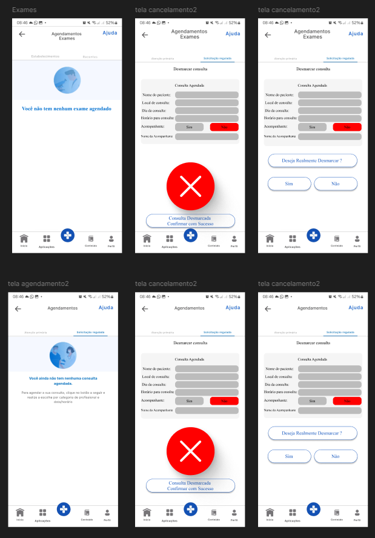

# Protótipo de Alta Fidelidade - Notificação de Cancelamento de Agendamentos

## Introdução

Um protótipo de alta fidelidade é uma representação visual detalhada da interface de um sistema, simulando com alta precisão o produto final. Ele inclui elementos gráficos refinados, interatividade e simulação de funcionalidades reais, permitindo uma avaliação mais aprofundada da usabilidade e validação dos requisitos.

Este documento apresenta o protótipo de alta fidelidade relacionado ao requisito [**RF66 - A aplicação notifica o cancelamento de agendamentos**](https://requisitos-de-software.github.io/2024.2-MeuSUSDigital/elicitacao/requisitos-elicitados/#RF66) do aplicativo [Meu SUS Digital](https://meususdigital.saude.gov.br/). O objetivo deste protótipo é validar a interface e a experiência do usuário no recebimento de notificações sobre o cancelamento de agendamentos, assegurando que a solução atenda às necessidades dos pacientes e profissionais de saúde de forma eficiente e intuitiva.

## Metodologia

Para a validação deste protótipo, foram seguidas as diretrizes da Engenharia de Requisitos, com foco em elicitação, modelagem e validação. O protótipo foi desenvolvido utilizando a ferramenta [Figma](https://www.figma.com) e submetido à avaliação de uma usuária real por meio de entrevista semiestruturada. O cronograma detalhado do processo de validação está descrito na **Tabela 1**.

    
<strong>Tabela 1 – Cronograma de validação do protótipo</strong>

| Avaliador | Entrevistado | Horário de Início | Horário de Término | Data | Ambiente/Local | 
| --------- | ------------ | :---------------: | :----------------: | :--: | -------------- |
| [Emivalto Júnior](https://github.com/EmivaltoJrr) | Vitoria | 21:24 | 21:30  | 07/02/2025  | Gravado Presenvial  |

    
Autor: <a href="https://github.com/EmivaltoJrr">Emivalto Júnior</a>.

## Protótipo de Alta Fidelidade

A **Figura 1** apresenta a interface desenvolvida para a notificação de cancelamento de agendamentos. Este protótipo permite que o usuário visualize uma notificação clara e objetiva sobre o cancelamento de um agendamento, exibindo informações essenciais como o tipo de agendamento (exame ou consulta), data e motivo do cancelamento. Além disso, oferece opções de ação, como reagendar o compromisso ou entrar em contato com a unidade de saúde responsável.

    
<strong>Figura 1 – Protótipo de "Notificação de Cancelamento de Agendamentos"</strong>

    
Autor: <a href="https://github.com/EmivaltoJrr">Emivalto Júnior</a>.

Já a **Figura 2** apresenta um panorama geral do protótipo de alta fidelidade desenvolvido no Figma. Este protótipo abrange tanto os aspectos funcionais quanto o refinamento visual da interface. Ele integra as funcionalidades dos protótipos relacionados aos requisitos [**RF66 - Notificação de Cancelamento de Agendamentos**](../validacao/prototipo-de-alta-fidelidade-rf66.md), [**RF67 - Consulta de Agendamentos Cancelados**](../validacao/prototipo-de-alta-fidelidade-rf66.md) e [**RF68 - Reagendamento de Compromissos**](../validacao/prototipo-de-alta-fidelidade-rf66.md). O design passou por diversas iterações com base em feedbacks recebidos, garantindo melhorias contínuas e aprimorando a experiência do usuário.

    
<strong>Figura 2 – Protótipo de Alta Fidelidade completo/geral desenvolvido no Figma</strong>

<iframe style="border: 1px solid rgba(0, 0, 0, 0.1);" width="800" height="450" src="https://embed.figma.com/proto/q4EKDnwJa17HsRN1v6hezz/Untitled?page-id=0%3A1&node-id=23-29&p=f&viewport=1576%2C453%2C0.15&scaling=scale-down&content-scaling=fixed&starting-point-node-id=23%3A29&embed-host=share" allowfullscreen></iframe>

    
Autor: <a href="https://github.com/EmivaltoJrr">Emivalto Júnior</a>.

## Aspectos Práticos

A validação do protótipo foi realizada com uma usuária real que utiliza o **Meu SUS Digital**. Durante o processo, buscou-se avaliar a clareza da interface, a facilidade de uso e a eficácia na transmissão das notificações de cancelamento.

Os participantes destacaram a importância de notificações objetivas e diretas, que permitam ações rápidas, como reagendar o compromisso ou buscar mais informações. Entre os aspectos positivos, foram mencionados a organização da tela, o design limpo e a simplicidade nas opções de interação. Já como sugestões de melhoria, foi apontada a necessidade de notificações em tempo real e a possibilidade de personalizar os tipos de notificações que o usuário deseja receber.

## Aspectos Éticos

O estudo seguiu os princípios éticos aplicáveis a pesquisas envolvendo usuários. Foi obtido o consentimento da participante para o uso de imagem, voz e demais informações durante a videochamada realizada via [Microsoft Teams](https://teams.microsoft.com/).

## Validação

A validação foi conduzida de maneira remota, em um ambiente controlado, no qual a participante navegou pelo protótipo e forneceu feedback qualitativo. O **Vídeo 1**, disponibilizado no YouTube como conteúdo não listado, documenta o processo de validação do protótipo.

    
<strong>Vídeo 1 – Validação do Protótipo "Notificação de Cancelamento de Agendamentos"</strong>

<iframe width="560" height="315" src="https://www.youtube.com/embed/AAkyfwza30c?si=NbFooCFRyKeEugDI" title="YouTube video player" frameborder="0" allow="accelerometer; autoplay; clipboard-write; encrypted-media; gyroscope; picture-in-picture; web-share" referrerpolicy="strict-origin-when-cross-origin" allowfullscreen></iframe>

    
Autor: <a href="https://github.com/EmivaltoJrr">Emivalto Júnior</a>.

## Resultados Obtidos

A validação foi realizada com uma usuária real, que considerou a interface clara, funcional e intuitiva. A usuária destacou a facilidade em compreender as notificações e sugeriu algumas melhorias, como a inclusão de notificações em tempo real e maior personalização das opções de ação. Essas sugestões foram documentadas e estão sendo analisadas para futuras iterações do design.

## 📚 Bibliografia

> VAZQUEZ, Carlos Eduardo; SIMÕES, Guilherme Siqueira. Engenharia de Requisitos: software orientado ao negócio. Rio de Janeiro: Brasport, 2016.
>
> REINEHR, Sheila. Engenharia de requisitos [recurso eletrônico]. Revisão técnica: Marco Antônio Paludo. Porto Alegre: SAGAH, 2020.

## 📑 Histórico de Versões

| Versão | Descrição | Autor(es) | Data de Produção | Revisor(es) | Data de Revisão | 
| :----: | --------- | --------- | :--------------: | ----------- | :-------------: |
| `1.0`  | Criação inicial da estrutura do documento referente à prototipação de alta fidelidade sobre o agendamento de exames pelo aplicativo Meu SUS Digital. | [Emivalto Júnior](https://github.com/EmivaltoJrr) | 03/02/2025 |  |  |
| `1.1`  | Revisão e melhoria do documento para adequação ao requisito RF66, incluindo ajustes textuais e maior clareza na descrição do protótipo e validação. | [Emivalto Júnior](https://github.com/EmivaltoJrr) | 06/02/2025 |  |  |
| `1.2`  | ajustando o texto e imagens, para melhor alinhamento dos requisitos. | [Emivalto Júnior](https://github.com/EmivaltoJrr) | 07/02/2025 |  |  |