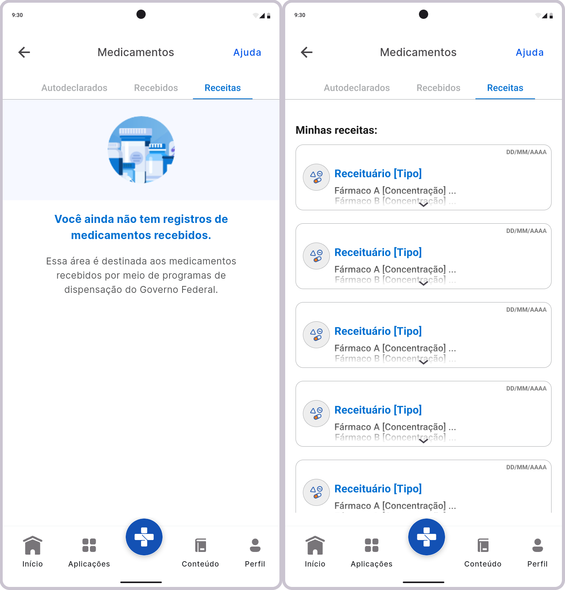

# Protótipo de Alta Fidelidade - Consultar Receitas Médicas

## Introdução

Um protótipo de alta fidelidade é uma representação visual detalhada da interface de um sistema, proporcionando uma experiência próxima ao produto final. Ele inclui elementos gráficos refinados, interatividade e simulação de funcionalidades reais, permitindo a avaliação da usabilidade e validação dos requisitos.

Este documento apresenta o protótipo de alta fidelidade relacionado ao requisito [**RF60 - A aplicação permite acompanhar o andamento de solicitações de medicamentos**](../elicitacao/requisitos-elicitados.md/#RF60) do aplicativo [Meu SUS Digital](https://meususdigital.saude.gov.br/). O objetivo deste protótipo é validar a interface e a experiência do usuário no acompanhamento das solicitações realizadas, garantindo que a solução atenda às necessidades dos pacientes e profissionais de saúde.

## Metodologia

Para validar este protótipo, foram seguidas as diretrizes de Engenharia de Requisitos baseadas na literatura, com ênfase em elicitação, modelagem e validação. O protótipo foi desenvolvido utilizando a ferramenta [Figma](https://www.figma.com) e submetido à avaliação de usuários reais por meio de entrevistas semiestruturadas. O cronograma da validação do protótipo está descrito na **Tabela 1**.

    
<strong>Tabela 1 – Cronograma de validação do protótipo</strong>

| Avaliador | Entrevistado | Horário de Início | Horário de Término | Data | Ambiente/Local | 
| --------- | ------------ | :---------------: | :----------------: | :--: | -------------- |
| [Matheus Henrick](https://github.com/MatheusHenrickSantos) | - | - | - | - | - |

    
Autor: <a href="https://github.com/MatheusHenrickSantos">Matheus Henrick</a>.

## Protótipo de Alta Fidelidade

A **Figura 1** apresenta a interface desenvolvida para a atividade de consulta à receita médica. O protótipo permite que o paciente visualize como será mostrado o histórico de receitas médicas quando não há nenhuma receita cadastrada e um exemplo genérico quando há várias receitas cadastradas.

    
<strong>Figura 1 – Protótipo de "Consultar Receitas Médicas"</strong>

    
Autor: <a href="https://github.com/MatheusHenrickSantos">Matheus Henrick</a>.

Já na **Figura 2**, é exibido o protótipo de alta fidelidade completo/geral desenvolvido no Figma, representando tanto os aspectos funcionais quanto o refinamento visual da interface. Tal protótipo contempla a união funcional dos protótipos [**Consultar Receitas Médicas**](../validacao/prototipo-de-alta-fidelidade-rf71.md) e [**Exportar Receitas Médicas**](../validacao/prototipo-de-alta-fidelidade-rf74.md), tratando, respectivamente, dos requisitos [RF71](../elicitacao/requisitos-elicitados.md/#RF71) e [RF74](../elicitacao/requisitos-elicitados.md/#RF62). O design passou por duas iterações baseadas em feedbacks, garantindo melhorias contínuas e aprimorando a experiência do usuário.

    
<strong>Figura 2 – Protótipo de Alta Fidelidade completo/geral desenvolvido no Figma</strong>

<iframe style="border: 1px solid rgba(0, 0, 0, 0.1);" width="800" height="450" src="https://embed.figma.com/design/Kmiu8p2JzjcXqcKLTuntc5/Prot%C3%B3tipo-Meu-SUS-Digital?node-id=0-1&embed-host=share" allowfullscreen></iframe>

    
Autor: <a href="https://github.com/MatheusHenrickSantos">Matheus Henrick</a>.

## Validação

A validação foi conduzida em um ambiente controlado, onde os participantes navegaram pelo protótipo e forneceram feedback qualitativo. Segue, abaixo, a **Gravação 1** referente à validação do protótipo, disponibilizada como vídeo não listado no YouTube:

    
<strong>Vídeo 1 – Validação do Protótipo "Consultar Receitas Médicas"</strong>

[video]

    
Autor: <a href="https://github.com/MatheusHenrickSantos">Matheus Henrick</a>.

## 📚 Bibliografia

> VAZQUEZ, Carlos Eduardo; SIMÕES, Guilherme Siqueira. Engenharia de Requisitos: software orientado ao negócio. Rio de Janeiro: Brasport, 2016.
>
> REINEHR, Sheila. Engenharia de requisitos [recurso eletrônico]. Revisão técnica: Marco Antônio Paludo. Porto Alegre: SAGAH, 2020.

## 📑 Histórico de Versões

| Versão | Descrição | Autor(es) | Data de Produção | Revisor(es) | Data de Revisão | 
| :----: | --------- | --------- | :--------------: | ----------- | :-------------: |
| `1.0`  | Criação do documento do protótipo de alta fidelidade sobre a funcionalidade de consultar receitas médicas. | [Matheus Henrick](https://github.com/MatheusHenrickSantos) | 03/02/2025 |  |  |
