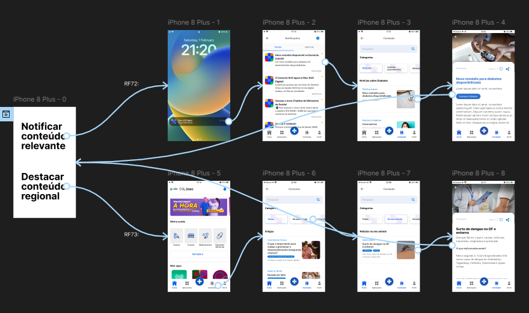

# Protótipo de Alta Fidelidade - Notificar e Destacar Conteúdo

## Introdução

Um protótipo de alta fidelidade é uma representação visual detalhada da interface de um sistema, proporcionando uma experiência próxima ao produto final. Ele inclui elementos gráficos refinados, interatividade e simulação de funcionalidades reais.

Este documento apresenta o protótipo de alta fidelidade relacionado ao requisito [**RF72**: Notificar atualização de conteúdo relevante](../elicitacao/requisitos-elicitados.md/#RF72) e [**RF73**: Destacar conteúdo regional/estadual](../elicitacao/requisitos-elicitados.md/#RF73) do aplicativo [Meu SUS Digital](https://meususdigital.saude.gov.br/).

## Metodologia

Segundo <a href="#REF1">(WIEGER; BEATTY, 2013a)</a>, prototipação cumpre um papel de destaque na engenharia de requisitos: clarificar, completar e validar requisitos. Um protótipo tem o poder de resolver incertezas logo nos estágios iniciais do desenvolvimento, através da avaliação do protótipo. Nessa avaliação, um usuário interage com o protótipo, instruído sobre as tarefas a serem realizadas e as limitações por não ser uma implementação real. A partir disso, a interação é observada, na busca por dificuldades ou desvantagens da interface. Perguntas podem ser feitas ao final ou durante a realização de cada tarefa proposta ao usuário <a href="#REF2">(WIEGER; BEATTY, 2013b)</a>.

## Protótipo de Alta Fidelidade

A **Figura 1** apresenta uma captura de tela do protótipo, enquanto a **Figura 2** apresenta a versão interagível do protótipo. 

    
<strong>Figura 1 – Captura das Telas do Protótipo</strong>

    
Autor: <a href="https://github.com/JoosPerro">João Pedro</a>.

    
<strong>Figura 2 – Protótipo Incorporado para Interação</strong>

<iframe style="border: 1px solid rgba(0, 0, 0, 0.1);" width="800" height="450" src="https://embed.figma.com/proto/fQzhBjwlGi4LyHWTWiJibW/Meu-SUS-Digital?node-id=35-75&p=f&scaling=scale-down&content-scaling=fixed&page-id=0%3A1&starting-point-node-id=35%3A75&embed-host=share" allowfullscreen></iframe>

    
Autor: <a href="https://github.com/JoosPerro">João Pedro</a>.

## 📚 Bibliografia

> WIEGERS, Karl; BEATTY, Joy. **Software Requirements**: Third Edition. 3. Ed. Washington: Microsoft Press, 2013. p. 296.
>
> *Ibdem*, p. 307.

## 📑 Histórico de Versões

| Versão | Descrição | Autor(es) | Data de Produção | Revisor(es) | Data de Revisão |
| :----: | --------- | --------- | :--------------: | ----------- | :-------------: |
| `1.0`  | Criação do documento | [João Pedro](https://github.com/JoosPerro) | 03/02/2025 | [Matheus Henrick](https://github.com/MatheusHenrickSantos) | 03/02/2025 |
| `1.1`  | Adição de captura de tela do protótipo e correções do padrão | [João Pedro](https://github.com/JoosPerro) | 09/02/2025 | [Emivalto Júnior](https://github.com/EmivaltoJrr) | 09/02/2025 |
