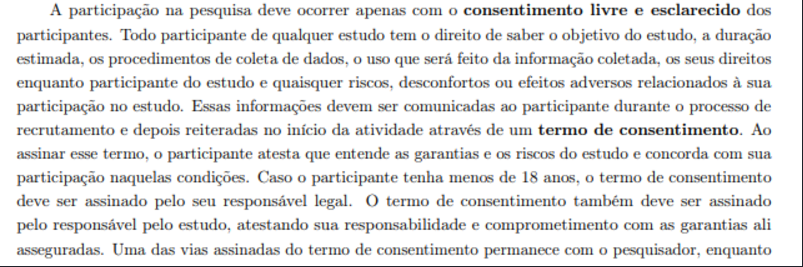
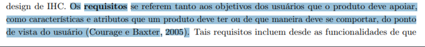
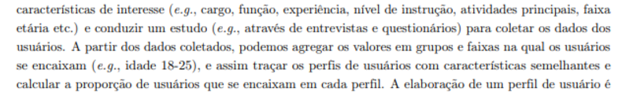
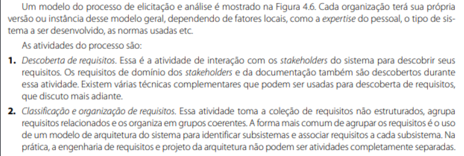

# Autoavaliação do Grupo 4

## Introdução

Conforme planejado, o Grupo 4 deve inspecionar os artefatos que produziu, visando a correção futura de artefatos que não atendem aos seus requisitos especificados.

## Objetivos

O objetivo deste documento é relatar os resultados da autoavaliação da 2ª etapa do projeto do [Grupo 4](https://requisitos-de-software.github.io/2024.2-MeuSUSDigital/), em forma de inspeção. Será verificado se os artefatos produzidos nesta segunda etapa cumprem com as condições e padrões exigidos. É importante citar que essa verificação não tem como intuito diminuir os membros responsáveis por cada artefato ou seu trabalho, apenas aplicar os conceitos de verificação.

## Inspeção

A inspeção foi baseada na [lista de verificação da 2ª entrega](../../lista_verif/entrega2.md) produzida com a ajuda do professor e dos integrantes do grupo.

### Tabela 1 ─ Resultado da Inspeção de Elicitação, Técnicas e Priorização.

 

**Tabela 1** – Elicitação, Técnicas e Priorização.

|        ID        | Descrição                                                                                                           | Avaliação  | Autor        | Data e hora |
| :--------------: | ------------------------------------------------------------------------------------------------------------------- | :--------: | ------------ | ------------- |
| **Itens do Desenvolvimento do projeto** |                                                                                                                     |            |              |               |
|        1         | 1 - A Especificação do Perfil do usuário possui informação de:   • Idade (criança, jovem, adulto, terceira idade etc.);   • Experiência (leigo/ novato, especialista);   • Atitudes (tecnófilos, tecnófobos);   • tarefas primárias (compra, venda)                       |    Sim    | André Barros |         24/11/2024 - 22:50       |
|        2         | Um cronograma (data e horário) e local para realização da elicitação dos requisitos com o do cliente e/ou persona do projeto? | Sim | André Barros |     24/11/2024 - 22:50           |
|        3         | No mínimo três técnicas de elicitação foram utilizadas (quanto mais melhor)?                                                                                           |    Sim    | André Barros |    24/11/2024 - 22:50           |
|        4         | A participação do cliente e/ou persona na elicitação de requisitos?                                             |    Sim     | André Barros |        24/11/2024 - 22:50        |
|        5         | A gravação e o(s) registro(s) da elicitação dos requisitos (pré-rastreabilidade)?                                                                                             |    Sim     | André Barros |    24/11/2024 - 22:50            |
|        6         | Um cronograma (data e horário) e local para realização da priorização dos requisitos com o do cliente e/ou persona do projeto?    |    Sim     | André Barros |      24/11/2024 - 22:50         |
|        7         | No mínimo duas técnicas de priorização (quanto mais melhor)?   * A técnica de MoSCoW* / 100 $* só devem ser  utilizados no projeto após a utilização de outras duas técnicas de priorização no  projeto.                                                      |    Incompleto    | André Barros |       24/11/2024 - 22:50       |
|        8         | A participação do cliente e/ou persona no processo de priorização?                                                                                   |    Sim     | André Barros |       24/11/2024 - 22:50         |
|        9         | A gravação e o(s) registro(s) da atividade de priorização dos requisitos?                                                                               |    Sim     | André Barros |     24/11/2024 - 22:50          |
| **Itens do Conteúdo da Disciplina** (a foto referente ao texto está no ID) |                                                                                                                     |            |              |               |
|        <a id="REF1" href="#anchor_1">Q1</a>        |  Os participantes das técnicas, que tiveram dados utilizados, receberam e aprovaram um termo de consentimento?                                                                          |    Sim     | Pedro Lopes |  24/11/2024 - 22:50       |
|        <a id="REF2" href="#anchor_2">Q2</a>        |Os requisitos se referem tanto aos objetivos dos usuários quanto as características que um produto deve ter ou se comportar?  |    Sim     | Artur Ricardo |      24/11/2024 - 22:50          |
|        <a id="REF3" href="#anchor_3">Q3</a>        | O questionário aplicado leva em consideração características de comportamento do usuário? |    Sim     | João Pedro |      24/11/2024 - 22:50          |
|        <a id="REF4" href="#anchor_4">Q4</a>        | O perfil de usuário foi traçado com base nos dados coletados? |    Sim     | Matheus Henrick |     24/11/2024 - 22:50         |
|        <a id="REF5" href="#anchor_5">Q5</a>        | Foram elicitados requisitos funcionais e não funcionais? |    Sim     | Emivalto Junior |       24/11/2024 - 22:50         |

_Autor: Pedro Lopes._

  

  

## Gravação da Inspeção do Grupo 4

<iframe width="560" height="315" src="https://www.youtube.com/embed/hmPALPK36dE?si=5p39o5Xm4DSlKxew" title="YouTube video player" frameborder="0" allow="accelerometer; autoplay; clipboard-write; encrypted-media; gyroscope; picture-in-picture; web-share" referrerpolicy="strict-origin-when-cross-origin" allowfullscreen></iframe>

  

## 📚 Referências Bibliográficas

> - SOMMERVILLE, Ian. Engenharia de software. 08. ed. São Paulo: Pearson Addison Wesley, 2007
>
> - <a id="anchor_1" href="#REF1">P1</a> 
>****
> - <a id="anchor_2" href="#REF2">P2</a> 
>****
> - <a id="anchor_3" href="#REF3">P3</a> 
>****
> - <a id="anchor_4" href="#REF4">P4</a> 
>****
> - <a id="anchor_5" href="#REF5">P5</a> 

## 📑 Histórico de Versão

| Versão | Descrição | Autor(es) | Data de Produção | Revisor(es) | Data de Revisão | 
| :----: | --------- | --------- | :--------------: | ----------- | :-------------: |
| `1.0`  | Criação do documento. | [Pedro Lopes](https://github.com/pLopess) | 24/11/2024 | [Emivalto Júnior](https://github.com/EmivaltoJrr)  | 24/11/2024 |
| `1.1`  | Criação do documento. | [Emivalto Júnior](https://github.com/EmivaltoJrr) | 24/11/2024 | [Matheus Henrick](https://github.com/MatheusHenrickSantos) | 24/11/2024 |
| `1.2`  | Correção de erros. | [Emivalto Junio](https://github.com/EmivaltoJrr) | 30/11/2024 | [Artur Ricardo](https://github.com/algorithmorphic) | 17/12/2024 |

