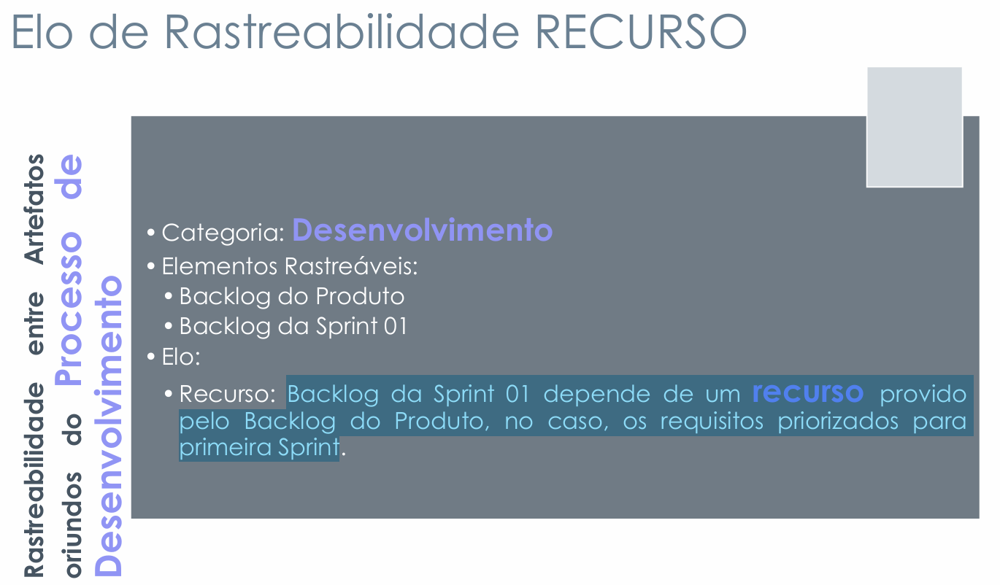
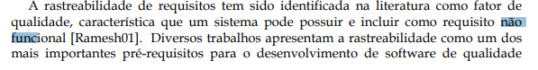
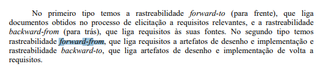
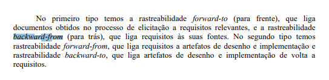

# Autoavaliação do Grupo 4

## Introdução

Conforme planejado, o Grupo 4 deve inspecionar os artefatos que produziu, visando a correção futura de artefatos que não atendem aos seus requisitos especificados.

## Objetivos

O objetivo deste documento é relatar os resultados da autoavaliação da 6ª etapa do projeto do [Grupo 4](https://requisitos-de-software.github.io/2024.2-MeuSUSDigital/), em forma de inspeção. Será verificado se os artefatos produzidos nesta segunda etapa cumprem com as condições e padrões exigidos. É importante citar que essa verificação não tem como intuito diminuir os membros responsáveis por cada artefato ou seu trabalho, apenas aplicar os conceitos de verificação.

## Inspeção

A inspeção foi baseada na [lista de verificação da 6ª entrega](../../lista_verif/entrega6.md) produzida com a ajuda do professor e dos integrantes do grupo.

**Tabela 1** ─ Lista de Verificação da Modelagem Ágil de Requisitos

<table border="1">
  <thead>
    <tr>
      <th>N°</th>
      <th>Questão</th>
      <th>Avaliação</th>
      <th>Autor</th>
      <th>Data e Hora</th>
      <th>Versão</th>
    </tr>
  </thead>
  <tbody>
    <tr>
      <td colspan="3" style="text-align: center; font-weight: bold;">Itens do Desenvolvimento do Projeto</td>
    </tr>
    <tr>
      <td>1</td>
      <td>O histórico de versão padronizado?</td>
      <td></td>
      <td>André Barros</td>
      <td></td>
      <td></td>
    </tr>
    <tr>
      <td>2</td>
      <td>O(s) autor(es) e o(s) revisor(es) para cada artefato?</td>
      <td></td>
      <td>André Barros</td>
      <td></td>
      <td></td>
    </tr>
    <tr>
      <td>3</td>
      <td>Referências bibliográficas e/ou bibliografia em todos os artefatos?</td>
      <td></td>
      <td>André Barros</td>
      <td></td>
      <td></td>
    </tr>
    <tr>
      <td>4</td>
      <td>As tabelas e imagens possuem legenda e fonte e elas chamadas dentro dos texto?</td>
      <td></td>
      <td>André Barros</td>
      <td></td>
      <td></td>
    </tr>
    <tr>
      <td>5</td>
      <td>Um texto fazendo uma introdução dos artefatos?</td>
      <td></td>
      <td>André Barros</td>
      <td></td>
      <td></td>
    </tr>
    <tr>
      <td>6</td>
      <td>O cronograma executado com quem realizou cada artefato/atividade com as datas de início e fim da construção realização do artefato/atividade?</td>
      <td></td>
      <td>André Barros</td>
      <td></td>
      <td></td>
    </tr>
    <tr>
      <td>7</td>
      <td>Ata(s) da(s) reuniões (com data, horário de início e do final, participantes, objetivo, atividades definidas etc)?</td>
      <td></td>
      <td>André Barros</td>
      <td></td>
      <td></td>
    </tr>
    <tr>
      <td>8</td>
      <td>A gravação da reunião do grupo?</td>
      <td></td>
      <td>André Barros</td>
      <td></td>
      <td></td>
    </tr>
    <tr>
      <td>9</td>
      <td>Vídeo de apresentação na categoria “não listado” no youtube?</td>
      <td></td>
      <td>André Barros</td>
      <td></td>
      <td></td>
    </tr>
  </tbody>
    <tr>
      <td colspan="6" style="text-align: center; font-weight: bold;">Itens Desenvolvidos Pelo Grupo</td>
    </tr>
    <tr>
      <td>Q1</td>
      <td>Possui o artefato de BackwardFrom? <a id="anchor_1" href="#REF1">1</a></td>
      <td></td>
      <td>Pedro Lopes</td>
      <td></td>
      <td></td>
    </tr>
    <tr>
      <td>Q2</td>
      <td>Foi feita uma matriz de rastreabilidade? <a id="anchor_2" href="#REF2">2</a></td>
      <td></td>
      <td>Pedro Lopes</td>
      <td></td>
      <td></td>
    </tr>
    <tr>
      <td>Q3</td>
      <td>Os principais Elos de Rastreabilidade foram utilizados (Satisfação, Recurso, Responsabilidade, Representação, Alocado e Agregação)? <a id="anchor_3" href="#REF3">3</a></td>
      <td></td>
      <td>Pedro Lopes</td>
      <td></td>
      <td></td>
    </tr>
    <tr>
      <td>Q4</td>
      <td>A rastreabilidade vem sendo mantida? <a id="anchor_4" href="#REF4">4</a></td>
      <td></td>
      <td>Artur Ricardo</td>
      <td></td>
      <td></td>
    </tr>
    <tr>
      <td>Q5</td>
      <td>A análise de impacto de mudanças nos requisitos foi realizada de forma adequada? <a id="anchor_5" href="#REF5">5</a></td>
      <td></td>
      <td>Artur Ricardo</td>
      <td></td>
      <td></td>
    </tr>
    <tr>
      <td>Q6</td>
      <td>Os elos (ou vínculos) foram identificados e documentados durante a rastreabilidade dos requisitos? <a id="anchor_6" href="#REF6">6</a></td>
      <td></td>
      <td>Artur Ricardo</td>
      <td></td>
      <td></td>
    </tr>
    <tr>
      <td>Q7</td>
      <td>Cada Elo de Rastreabilidade apresenta os elementos de origem e destino que são relacionados por ele?<a id="anchor_7" href="#REF7">7</a></td>
      <td></td>
      <td>João Pedro</td>
      <td></td>
      <td></td>
    </tr>
    <tr>
      <td>Q8</td>
      <td>As informações tratadas pelos elos são classificadas conforme os quatro níveis de informação (ambiental, organizacional, gerencial, desenvolvimento)?<a id="anchor_8" href="#REF8">8</a></td>
      <td></td>
      <td>João Pedro</td>
      <td></td>
      <td></td>
    </tr>
    <tr>
      <td>Q9</td>
      <td>Cada elo apresenta <em>links</em> para os respectivos elementos referenciados?<a id="anchor_9" href="#REF9">9</a></td>
      <td></td>
      <td>João Pedro</td>
      <td></td>
      <td></td>
    </tr><tr>
      <td>Q10</td>
      <td>A matriz de rastreabilidade segue um padrão?<a id="anchor_2" href="#REF2">2</a></td>
      <td></td>
      <td>Matheus Henrick</td>
      <td></td>
      <td></td>
    </tr><tr>
      <td>Q11</td>
      <td>Os elos de rastreabilidade do <em>Backward From</em> foram feitos da maneira correta?<a id="anchor_10" href="#REF10">10</a></td>
      <td></td>
      <td>Matheus Henrick</td>
      <td></td>
      <td></td>
    </tr><tr>
      <td>Q12</td>
      <td>Os elos de rastreabilidade do <em>Forward From</em> foram feitos da maneira correta?<a id="anchor_10" href="#REF10">10</a></td>
      <td></td>
      <td>Matheus Henrick</td>
      <td></td>
      <td></td>
    </tr>
    <tr>
      <td>Q13</td>
      <td>Existe uma pós-rastreabilidade, que demonstre como os requisitos não-funcionais (como segurança, desempenho ou usabilidade) foram implementados.<a id="anchor_11" href="#REF11">11</a></td>
      <td></td>
      <td>Emivalto Júinior</td>
      <td></td>
      <td></td>
    </tr>
      <td>Q14</td>
      <td>Possui uma matriz de rastreabilidade forward-from que demonstra claramente as ligações entre os requisitos elicitados<a id="anchor_12" href="#REF12">12</a></td>
      <td></td>
      <td>Emivalto Júinior</td>
      <td></td>
      <td></td>
    </tr>
      <td>Q15</td>
      <td>O repositório contém uma documentação de rastreabilidade backward-from que permite identificar a origem e evolução dos requisitos, incluindo suas fontes?<a id="anchor_13" href="#REF13">13</a></td>
      <td></td>
      <td>Emivalto Júinior</td>
      <td></td>
      <td></td>
    </tr>
  </tbody>
</table>

  
Autores: <a href="https://github.com/pLopess">Pedro Lopes</a>, <a href="https://github.com/EmivaltoJrr">Emivalto Júnior</a>, <a href="https://github.com/JoosPerro">João Pedro</a>, <a href="https://github.com/algorithmorphic">Artur Ricardo</a>, <a href="https://github.com/MatheusHenrickSantos">Matheus Henrick</a> e André Barros.

## Gravação da Inspeção do Grupo 4

  
Autores: <a href="https://github.com/pLopess">Pedro Lopes</a>, <a href="https://github.com/EmivaltoJrr">Emivalto Júnior</a>, <a href="https://github.com/JoosPerro">João Pedro</a>, <a href="https://github.com/algorithmorphic">Artur Ricardo</a>, <a href="https://github.com/MatheusHenrickSantos">Matheus Henrick</a>

## 📚 Referências Bibliográficas

> VAZQUEZ, Carlos Eduardo; SIMÕES, Guilherme Siqueira. Engenharia de Requisitos: software orientado ao negócio. Rio de Janeiro: Brasport, 2016.
>
> Reinehr, Sheila. _Engenharia de Requisitos [recurso eletrônico]_. Revisão técnica de Marco Antônio Paludo. Porto Alegre: SAGAH, 2020. 
>
><a id="REF1">1.</a> 
>****
><a id="REF2">2.</a> 
>****
><a id="REF3">3.</a> 
>****
>****
><a id="REF4">4.</a> 
>****
>****
><a id="REF5">5.</a> 
>****
>****
><a id="REF6">6.</a> 
>****
><a id="REF7">7.</a>  TORANZO, M.; CASTRO, J.; MELO, E. Uma proposta para melhorar o rastreamento de requisitos. **WER**, Valencia, Espanha, p. 194-209, nov. 2002, figura 4.
>****
><a id="REF8">8.</a>  TORANZO, M.; CASTRO, J.; MELO, E. Uma proposta para melhorar o rastreamento de requisitos. **WER**, Valencia, Espanha, p. 194-209, nov. 2002, figura 3.
>****
><a id="REF9">9.</a>  VAZQUEZ, Carlos Eduardo; SIMÕES, Guilherme Siqueira. **Engenharia de Requisitos**: software orientado ao negócio. Rio de Janeiro: Brasport, 2016, p. 3.
>****
><a id="REF10">10.</a>Exemplo de Elo de Recurso  SERRANO, Milene; SERRANO, Maurício. *Requisitos – Aula 26*. 2017. Apresentação de slides, p.23. Disponível em: [https://aprender3.unb.br/pluginfile.php/2972560/mod_resource/content/1/Requisitos%20-%20Aula%20026.pdf](https://aprender3.unb.br/pluginfile.php/2972560/mod_resource/content/1/Requisitos%20-%20Aula%20026.pdf). Acesso em: 16 jan. 2025.
>****
><a id="REF11">11.</a>  **Rastreabilidade de requisitos** miriam Sayão, julio cesar Sampaio de Padro Leite 
Monografias em Ciência da Computação, No. 20/05, Editor: Prof. Carlos José Pereira de Lucena Maio, 2005
>****
><a id="REF12">12.</a>  **Rastreabilidade de requisitos** miriam Sayão, julio cesar Sampaio de Padro Leite 
>****
><a id="REF13">13.</a>  **Rastreabilidade de requisitos** miriam Sayão, julio cesar Sampaio de Padro Leite 
>****

## 📑 Histórico de versão

| Versão | Descrição | Autor(es) | Data de Produção | Revisor(es) | Data de Revisão | 
| :----: | --------- | --------- | :--------------: | ----------- | :-------------: |
| `1.0`  | Criação do documento. | [Pedro Lopes](https://github.com/pLopess) | 19/01/2025 | [Emivalto Júnior](https://github.com/EmivaltoJrr) | 19/01/2025 |
| `1.1`  | Criando tabela. | [Pedro Lopes](https://github.com/pLopess) | 19/01/2025 | [Emivalto Júnior](https://github.com/EmivaltoJrr) | 19/01/2025 |