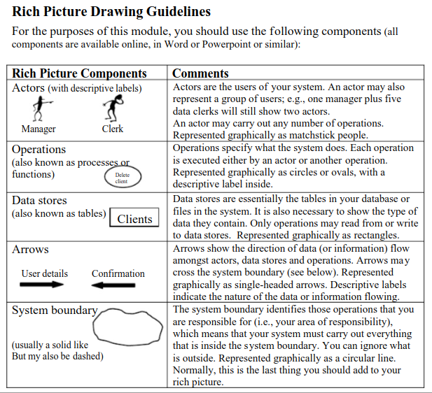

# Lista de Verificação de Artefatos

## 1. Verificação do Planejamento Geral do Projeto

### Tabela 1.1: Questões do Planejamento Geral

| N° |                      Questão                          | Autor |
|----|-------------------------------------------------------|-------|
| 01 | O github pages possui uma página que apresente os integrantes da equipe com foto, nome, mas sem matrícula? | André Barros|
| 02 | O cronograma do planejamento apresenta todas as atividades, de todas as etapas, para cada integrante, com as datas de início e fim das entregas dos artefatos, e com o período da revisão deles? | André Barros |
| 03 | O cronograma do planejamento apresenta um período de gravação da apresentação de cada etapa? | André Barros |
| 04 | O cronograma prevê um período de revisão e ajustes nos artefatos, devidos às considerações dos monitores ou do professor? | André Barros |
| 05 | O github pages apresenta a motivação e os critérios para a escolha do App?  | André Barros |
| 06 | O github pages apresenta uma cópia do Termo de Uso, Direito de Uso ou Propriedade Intelectual do aplicativo permitindo o estudo na disciplina? | André Barros |
| 07 | O github pages possui opção de contraste de cores? | André Barros |
| 08 |  |  |

### Tabela 1.2: Respostas da Verificação do Planejamento Geral - Autoavaliação

| N° | Resposta | Observação | Versão do Artefato | Data | Horário |
|----|----------|------------|--------------------|------|---------|
| 01 |  |  |  | DD/MM/AA | HH:MM |
| 02 |  |  |  | DD/MM/AA | HH:MM |
| 03 |  |  |  | DD/MM/AA | HH:MM |
| 04 |  |  |  | DD/MM/AA | HH:MM |
| 05 |  |  |  | DD/MM/AA | HH:MM |
| 06 |  |  |  | DD/MM/AA | HH:MM |
| 07 |  |  |  | DD/MM/AA | HH:MM |
| 08 |  |  |  | DD/MM/AA | HH:MM |

### Tabela 1.3: Respostas da Verificação do Planejamento Geral - Grupo 5

| N° | Resposta | Observação | Versão do Artefato | Data | Horário |
|----|----------|------------|--------------------|------|---------|
| 01 |  |  |  | DD/MM/AA | HH:MM |
| 02 |  |  |  | DD/MM/AA | HH:MM |
| 03 |  |  |  | DD/MM/AA | HH:MM |
| 04 |  |  |  | DD/MM/AA | HH:MM |
| 05 |  |  |  | DD/MM/AA | HH:MM |
| 06 |  |  |  | DD/MM/AA | HH:MM |
| 07 |  |  |  | DD/MM/AA | HH:MM |
| 08 |  |  |  | DD/MM/AA | HH:MM |

## 2. Verificação do Desenvolvimento do Projeto

### Tabela 2.1: Questões do Desenvolvimento do Projeto

| N° |                      Questão                          | Autor |
|----|-------------------------------------------------------|-------|
| 01 | O histórico de versão é padronizado? | André Barros |
| 02 | Existe(m) autor(es) e revisor(es) para cada artefato? | André Barros |
| 03 | Existem referências bibliográficas e/ou bibliografia em todos os artefatos? | André Barros |
| 04 | As tabelas e imagens possuem legenda e fonte, e são referenciadas pelo texto? | André Barros |
| 05 | Existe texto de introdução para os artefatos? | André Barros |
| 06 | O cronograma executado apresenta quem realizou cada artefato/atividade com data de início e fim da construção/realização do mesmo? | André Barros |
| 07 | As atas de reunião possuem data, horário de início e fim, participantes, objetivo, atividades definidas, etc.? | André Barros |
| 08 | As reuniões de grupo foram gravadas? | André Barros |
| 09 | O vídeo de apresentação tem categoria “não listado” no youtube? | André Barros |
| 10 |  |  |

### Tabela 2.2: Respostas da Verificação do Desenvolvimento do Projeto - Autoavaliação

| N° | Resposta | Observação | Versão do Artefato | Data | Horário |
|----|----------|------------|--------------------|------|---------|
| 01 |  |  |  | DD/MM/AA | HH:MM |
| 02 |  |  |  | DD/MM/AA | HH:MM |
| 03 |  |  |  | DD/MM/AA | HH:MM |
| 04 |  |  |  | DD/MM/AA | HH:MM |
| 05 |  |  |  | DD/MM/AA | HH:MM |
| 06 |  |  |  | DD/MM/AA | HH:MM |
| 07 |  |  |  | DD/MM/AA | HH:MM |
| 08 |  |  |  | DD/MM/AA | HH:MM |
| 09 |  |  |  | DD/MM/AA | HH:MM |
| 10 |  |  |  | DD/MM/AA | HH:MM |

### Tabela 2.3: Respostas da Verificação do Desenvolvimento do Projeto - Grupo 5

| N° | Resposta | Observação | Versão do Artefato | Data | Horário |
|----|----------|------------|--------------------|------|---------|
| 01 |  |  |  | DD/MM/AA | HH:MM |
| 02 |  |  |  | DD/MM/AA | HH:MM |
| 03 |  |  |  | DD/MM/AA | HH:MM |
| 04 |  |  |  | DD/MM/AA | HH:MM |
| 05 |  |  |  | DD/MM/AA | HH:MM |
| 06 |  |  |  | DD/MM/AA | HH:MM |
| 07 |  |  |  | DD/MM/AA | HH:MM |
| 08 |  |  |  | DD/MM/AA | HH:MM |
| 09 |  |  |  | DD/MM/AA | HH:MM |
| 10 |  |  |  | DD/MM/AA | HH:MM |

## 3. Verificação dos Rich Pictures

### Tabela 3.1: Questões do Rich Picture

| N° |                      Questão                          | Autor |
|----|-------------------------------------------------------|-------|
| 01 | Os artefatos de Rich Picture possuem legenda explicando os símbolos utilizados no diagrama? [1](#figura-1) |  |
| 02 | Todos os 5 componentes de um Rich Picture estão presentes no artefato apresentado pelo grupo? [2](#figura-1) |  |
| 03 |  |  |

### Tabela 3.2: Respostas da Verificação do Rich Pictures - Autoavaliação

| N° | Resposta | Observação | Versão do Artefato | Data | Horário |
|----|----------|------------|--------------------|------|---------|
| 01 |  |  |  | DD/MM/AA | HH:MM |
| 02 |  |  |  | DD/MM/AA | HH:MM |
| 03 |  |  |  | DD/MM/AA | HH:MM |
| 04 |  |  |  | DD/MM/AA | HH:MM |
| 05 |  |  |  | DD/MM/AA | HH:MM |
| 06 |  |  |  | DD/MM/AA | HH:MM |
| 07 |  |  |  | DD/MM/AA | HH:MM |
| 08 |  |  |  | DD/MM/AA | HH:MM |
| 09 |  |  |  | DD/MM/AA | HH:MM |
| 10 |  |  |  | DD/MM/AA | HH:MM |

### Tabela 3.3: Respostas da Verificação do Desenvolvimento do Projeto - Grupo 5

| N° | Resposta | Observação | Versão do Artefato | Data | Horário |
|----|----------|------------|--------------------|------|---------|
| 01 |  |  |  | DD/MM/AA | HH:MM |
| 02 |  |  |  | DD/MM/AA | HH:MM |
| 03 |  |  |  | DD/MM/AA | HH:MM |
| 04 |  |  |  | DD/MM/AA | HH:MM |
| 05 |  |  |  | DD/MM/AA | HH:MM |
| 06 |  |  |  | DD/MM/AA | HH:MM |
| 07 |  |  |  | DD/MM/AA | HH:MM |
| 08 |  |  |  | DD/MM/AA | HH:MM |
| 09 |  |  |  | DD/MM/AA | HH:MM |
| 10 |  |  |  | DD/MM/AA | HH:MM |

## Referências Bibliográficas

### figura 1: Referência de Rich Picture {#figura-1}

Rich Picture Drawing Guidelines. CTEC2402 - Software Development Project.

## Histórico de Versão

| Versão | Descrição | Autor | Data | Revisor | Data de revisão |  
|--------|-----------|-------|------|---------|-----------------|
|  1.0   | Criação do documento | [João Pedro](https://github.com/JoosPerro) | 30/10/2024 |  |  |
