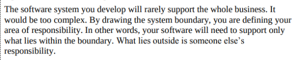

# Lista de Verificação - Entrega 1

## Introdução

Nessa primeira etapa a verificação é uma das etapas mais importantes do desenvolvimento de qualquer projeto. Já que é nessa etapa onde os artefatos produzidos são analisados para que os mesmos cumpram com os seus requisitos especificados. Desse modo, os artefatos que serão vistos a seguir visa apresentar o planejamento para a verificação de cada artefato da primeira entrega do grupo.

## Objetivos

O objetivo deste artefato é registrar a lista de verificação da 1ª etapa do Grupo 4, que será utilizada para verificar artefatos do próprio grupo e do Grupo 5.

## Metodologia

Através de reuniões, o grupo decidiu adotar a metodologia de verificação por inspeção desenvolvida por Fagan (Michael E. Fegan) em 1976. Dessa maneira, cada integrante participa na entrega do projeto nos prazos planejados. Cada artefato varificado gera um relatório anexado junto aos demais artefatos daquela entrega. Para responder às perguntas apresentadas nas listas de verificação o avaliador usará as opções **Sim**, **Não**, **Incompleto** ou **Não se aplica**. O avaliador tambem poderá escrever observações para cada item, se achar necessário.

## Tabela 1 ─ Lista de Verificação do Planejamento Geral do Projeto

| N° |                      Questão                          | Autor |
|----|-------------------------------------------------------|-------|
| 01 | O github pages possui uma página que apresente os integrantes da equipe com foto, nome, mas sem matrícula? | André Barros|
| 02 | O cronograma do planejamento apresenta todas as atividades, de todas as etapas, para cada integrante, com as datas de início e fim das entregas dos artefatos, e com o período da revisão deles? | André Barros |
| 03 | O cronograma do planejamento apresenta um período de gravação da apresentação de cada etapa? | André Barros |
| 04 | O cronograma prevê um período de revisão e ajustes nos artefatos, devidos às considerações dos monitores ou do professor? | André Barros |
| 05 | O github pages apresenta a motivação e os critérios para a escolha do App?  | André Barros |
| 06 | O github pages apresenta uma cópia do Termo de Uso, Direito de Uso ou Propriedade Intelectual do aplicativo permitindo o estudo na disciplina? | André Barros |
| 07 | O github pages possui opção de contraste de cores? | André Barros |

Autor: André Barros

## Tabela 2 ─ Verificação do Desenvolvimento do Projeto

| N° |                      Questão                          | Autor |
|----|-------------------------------------------------------|-------|
| 01 | O histórico de versão é padronizado? | André Barros |
| 02 | Existe(m) autor(es) e revisor(es) para cada artefato? | André Barros |
| 03 | Existem referências bibliográficas e/ou bibliografia em todos os artefatos? | André Barros |
| 04 | As tabelas e imagens possuem legenda e fonte, e são referenciadas pelo texto? | André Barros |
| 05 | Existe texto de introdução para os artefatos? | André Barros |
| 06 | O cronograma executado apresenta quem realizou cada artefato/atividade com data de início e fim da construção/realização do mesmo? | André Barros |
| 07 | As atas de reunião possuem data, horário de início e fim, participantes, objetivo, atividades definidas, etc.? | André Barros |
| 08 | As reuniões de grupo foram gravadas? | André Barros |
| 09 | O vídeo de apresentação tem categoria “não listado” no youtube? | André Barros |

Autor: André Barros

## Tabela 3 ─ Lista de Verificação do Rich Picture

| N° |                      Questão                          | Autor |
|----|-------------------------------------------------------|-------|
| 01 | Os artefatos de Rich Picture possuem legenda explicando os símbolos utilizados no diagrama?  (Rich Picture Drawing Guidelines. CTEC2402 - Software Development Project) | André Barros |
| 02 | Todos os 5 componentes de um Rich Picture estão presentes no artefato apresentado pelo grupo?  (Rich Picture Drawing Guidelines. CTEC2402 - Software Development Project) | André Barros |
| 03 | O Rich Picture indica de alguma forma as motivações/intenções das pessoas envolvidas?  (HOWARD, Steve; MONK, Andrew; Methods and Tools, p. 24) | João Pedro |
| 04 | O Rich Picture apresenta os limites do sistema?  (CTEC2402, Software Development Project, p. 5) | Artur Ricardo |
| 05 | O Rich Picture apresenta cada ator relacionado com pelo menos uma atividade?  (CTEC2402 Software Development Project, p. 1)| Emivalto Júnior |
| 06 | O Rich Picture apresenta o fluxo de dados entre atores e sistema, e entre os componentes do sistema?  (CTEC2402 Software Development Project, p. 1) | Pedro Lopes |
| 07 | O Rich Picture informa os dados que são transmitidos, e o sentido em que são transmitidos?  (Rich Picture Drawing Guidelines. CTEC2402 - Software Development Project) | Matheus Henrick |

Autores: André Barros, [Grupo 4](https://github.com/Requisitos-de-Software/2024.2-MeuSUSDigital/tree/main#-equipe)

## 📚 Referências Bibliográficas

> - Rich Picture Drawing Guidelines. CTEC2402 - Software Development Project.
> - HOWARD, Steve; MONK, Andrew; Methods and Tools
> - SOMMERVILLE, Ian. Engenharia de software. 08. ed. São Paulo: Pearson Addison Wesley, 2007

## 📑 Histórico de versão

| Versão |          Descrição              |     Autor      |      Data      |   Revisor     |    Data de revisão    |  
|:------:|:-------------------------------:|:--------------:|:--------------:|:-------------:|:---------------------:|
|  `1.0`  | Criação do Documento |[Emivalto Júnior](https://github.com/EmivaltoJrr)| 05/11/2024   | [Pedro Lopes](https://github.com/pLopess) | 06/11/2024 |
|  `1.1`  | Organização das tabelas e algumas correções | [João Pedro](https://github.com/JoosPerro) | 18/11/2024 | [Pedro Lopes](https://github.com/pLopess) | 19/11/2024 |
