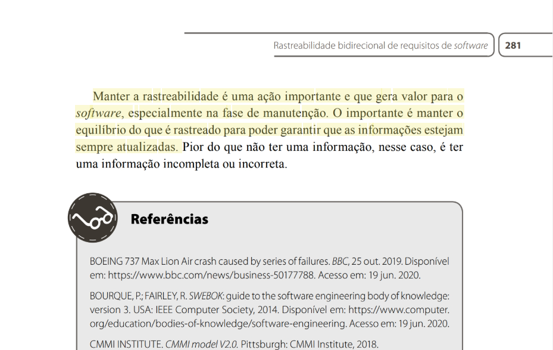
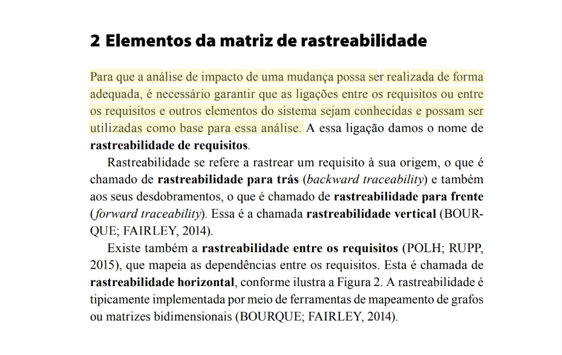
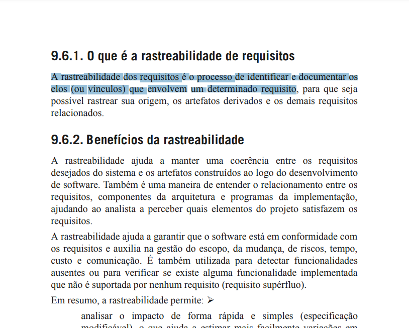
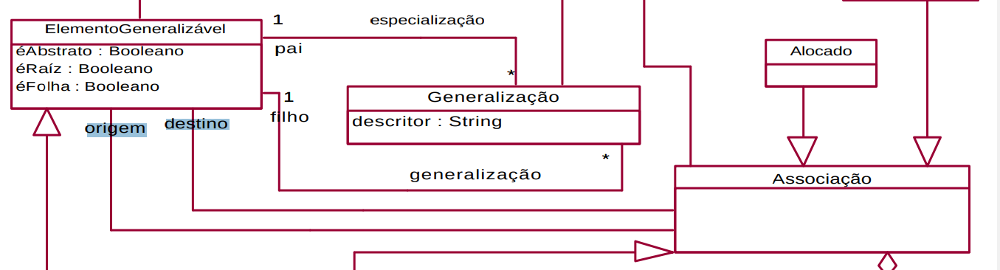
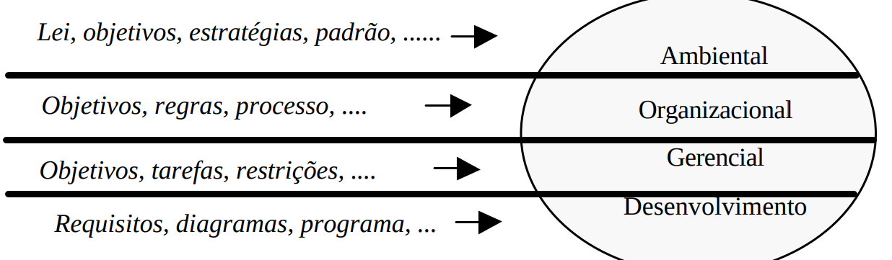
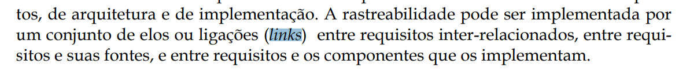

# Lista de Verificação - Entrega 6

## Introdução

O artefato apresenta o planejamento da verificação dos artefatos desenvolvidos pelo grupo 4 e grupo 5 durante a Etapa 6 (Pós Rastreabilidade).

## Objetivos

O objetivo deste documento é registrar a lista de verificação da 6ª etapa do Grupo 4, que será utilizada para verificar artefatos do próprio grupo e do Grupo 5.

## Metodologia

Através de reuniões, o grupo decidiu adotar a metodologia de verificação por inspeção desenvolvida por Fagan (Michael E. Fegan) em 1976. Dessa maneira, cada integrante participa na entrega do projeto nos prazos planejados. Cada artefato varificado gera um relatório anexado junto aos demais artefatos daquela entrega. Para responder às perguntas apresentadas nas listas de verificação o avaliador usará as opções **Sim**, **Não**, **Incompleto** ou **Não se aplica**. O avaliador tambem poderá escrever observações para cada item, se achar necessário.

## Lista de Verificação

**Tabela 1** ─ Lista de Verificação da Modelagem Ágil de Requisitos

<table border="1">
  <thead>
    <tr>
      <th>N°</th>
      <th>Questão</th>
      <th>Autor</th>
    </tr>
  </thead>
  <tbody>
    <tr>
      <td colspan="3" style="text-align: center; font-weight: bold;">Itens do Desenvolvimento do Projeto</td>
    </tr>
    <tr>
      <td>1</td>
      <td>O histórico de versão padronizado?</td>
      <td>André Barros</td>
    </tr>
    <tr>
      <td>2</td>
      <td>O(s) autor(es) e o(s) revisor(es) para cada artefato?</td>
      <td>André Barros</td>
    </tr>
    <tr>
      <td>3</td>
      <td>Referências bibliográficas e/ou bibliografia em todos os artefatos?</td>
      <td>André Barros</td>
    </tr>
    <tr>
      <td>4</td>
      <td>As tabelas e imagens possuem legenda e fonte e elas chamadas dentro dos texto?</td>
      <td>André Barros</td>
    </tr>
    <tr>
      <td>5</td>
      <td>Um texto fazendo uma introdução dos artefatos?</td>
      <td>André Barros</td>
    </tr>
    <tr>
      <td>6</td>
      <td>O cronograma executado com quem realizou cada artefato/atividade com as datas de início e fim da construção realização do artefato/atividade?</td>
      <td>André Barros</td>
    </tr>
    <tr>
      <td>7</td>
      <td>Ata(s) da(s) reuniões (com data, horário de início e do final, participantes, objetivo, atividades definidas etc)?</td>
      <td>André Barros</td>
    </tr>
    <tr>
      <td>8</td>
      <td>A gravação da reunião do grupo?</td>
      <td>André Barros</td>
    </tr>
    <tr>
      <td>9</td>
      <td>Vídeo de apresentação na categoria “não listado” no youtube?</td>
      <td>André Barros</td>
    </tr>
  </tbody>
    <tr>
      <td colspan="3" style="text-align: center; font-weight: bold;">Itens Desenvolvidos Pelo Grupo</td>
    </tr>
    <tr>
      <td>Q1</td>
      <td>Possui o artefato de BackwardFrom? <a id="anchor_1" href="#REF1">1</a></td>
      <td>Pedro Lopes</td>
    </tr>
    <tr>
      <td>Q2</td>
      <td>Foi feita uma matriz de rastreabilidade? <a id="anchor_2" href="#REF2">2</a></td>
      <td>Pedro Lopes</td>
    </tr>
    <tr>
      <td>Q3</td>
      <td>Os principais Elos de Rastreabilidade foram utilizados (Satisfação, Recurso, Responsabilidade, Representação, Alocado e Agregação)? <a id="anchor_3" href="#REF3">3</a></td>
      <td>Pedro Lopes</td>
    </tr>
        <tr>
      <td>Q4</td>
      <td>A rastreabilidade vem sendo mantida? <a id="anchor_4" href="#REF4">4</a></td>
      <td>Artur Ricardo</td>
    </tr>
        <tr>
      <td>Q5</td>
      <td>A análise de impacto de mudanças nos requisitos foi realizada de forma adequada? <a id="anchor_5" href="#REF5">5</a></td>
      <td>Artur Ricardo</td>
    </tr>
        <tr>
      <td>Q6</td>
      <td>Os elos (ou vínculos) foram identificados e documentados durante a rastreabilidade dos requisitos? <a id="anchor_6" href="#REF6">6</a></td>
      <td>Artur Ricardo</td>
    </tr>
        <tr>
      <td>Q7</td>
      <td>Cada Elo de Rastreabilidade apresenta os elementos de origem e destino que são relacionados por ele?<a id="anchor_7" href="#REF7">7</a></td>
      <td>João Pedro</td>
    </tr>
    <tr>
      <td>Q8</td>
      <td>As informações tratadas pelos elos são classificadas conforme os quatro níveis de informação (ambiental, organizacional, gerencial, desenvolvimento)?<a id="anchor_8" href="#REF8">8</a></td>
      <td>João Pedro</td>
    </tr>
    <tr>
      <td>Q9</td>
      <td>Cada elo apresenta <em>links</em> para os respectivos elementos referenciados?<a id="anchor_9" href="#REF9">9</a></td>
      <td>João Pedro</td>
    </tr>
  </tbody>
</table>

  
Autores: <a href="https://github.com/pLopess">Pedro Lopes</a>, <a href="https://github.com/EmivaltoJrr">Emivalto Júnior</a>, <a href="https://github.com/JoosPerro">João Pedro</a>, <a href="https://github.com/algorithmorphic">Artur Ricardo</a>, <a href="https://github.com/MatheusHenrickSantos">Matheus Henrick</a> e André Barros.

## 📚 Referências Bibliográficas

> VAZQUEZ, Carlos Eduardo; SIMÕES, Guilherme Siqueira. Engenharia de Requisitos: software orientado ao negócio. Rio de Janeiro: Brasport, 2016.
>
> Reinehr, Sheila. _Engenharia de Requisitos [recurso eletrônico]_. Revisão técnica de Marco Antônio Paludo. Porto Alegre: SAGAH, 2020. 
>
><a id="REF1">1.</a> 
>****
><a id="REF2">2.</a> 
>****
><a id="REF3">3.</a> 
>****
>****
><a id="REF4">4.</a> 
>****
>****
><a id="REF5">5.</a> 
>****
>****
><a id="REF6">6.</a> 
>****
><a id="REF7">7.</a>  TORANZO, M.; CASTRO, J.; MELO, E. Uma proposta para melhorar o rastreamento de requisitos. **WER**, Valencia, Espanha, p. 194-209, nov. 2002, figura 4.
>****
><a id="REF8">8.</a>  TORANZO, M.; CASTRO, J.; MELO, E. Uma proposta para melhorar o rastreamento de requisitos. **WER**, Valencia, Espanha, p. 194-209, nov. 2002, figura 3.
>****
><a id="REF9">9.</a>  VAZQUEZ, Carlos Eduardo; SIMÕES, Guilherme Siqueira. **Engenharia de Requisitos**: software orientado ao negócio. Rio de Janeiro: Brasport, 2016, p. 3.

## 📑 Histórico de versão

| Versão | Descrição | Autor(es) | Data de Produção | Revisor(es) | Data de Revisão | 
| :----: | --------- | --------- | :--------------: | ----------- | :-------------: |
| `1.0`  | Criação do documento. | [Pedro Lopes](https://github.com/pLopess) | 19/01/2025 |  |  |
| `1.1`  | Adicionando questões. | [Pedro Lopes](https://github.com/pLopess) | 19/01/2025 |  |  |
| `1.2`  | Adição das questões 4, 5 e 6. | [Artur Ricardo](https://github.com/algorithmorphic) | 19/01/2025 |  |  |
| `1.3`  | Atualização das referências bibliográficas. | [Artur Ricardo](https://github.com/algorithmorphic) | 19/01/2025 |  |  |
